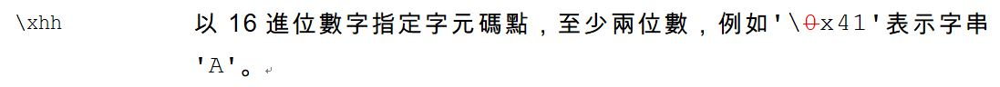
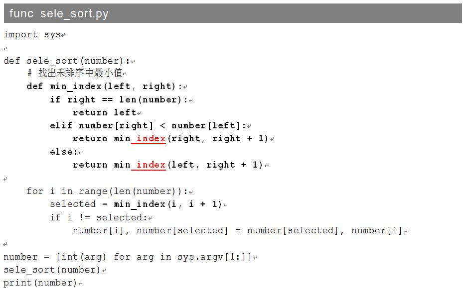
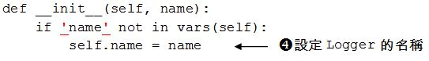
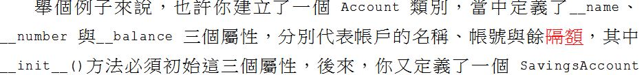
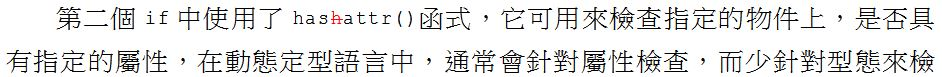
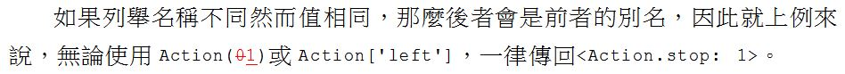
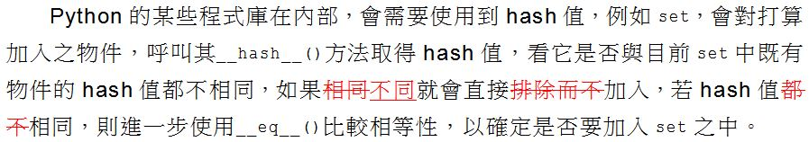
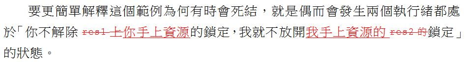
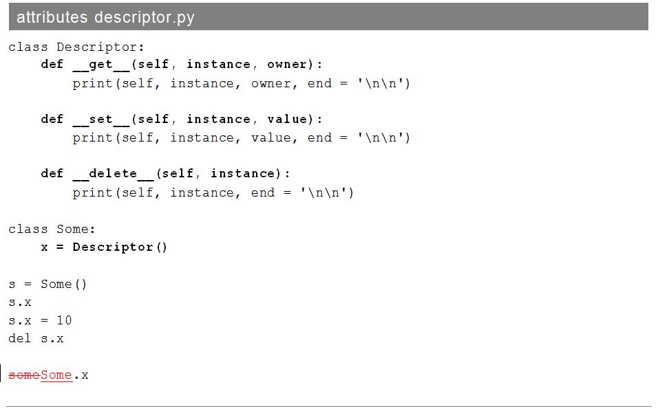

《Python 3.5 技術手冊》堪誤

## P3-6

   

## P3-31

   

## P4-15

   

## P4-27

   

## P4-29

   

## P4-36

   

## P5-23

   

## P5-33

   

## P6-11

   

## P6-14

   

## P6-18

   

## P7-10

   

# 第 8 章
    
   `newlines` 參數一律更正為 `newline` 參數

## P9-2

   

## P10-6

   

## P13-13

   

## P14-2

   